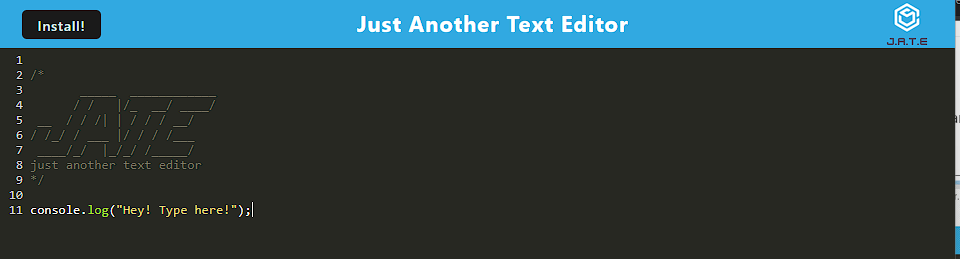

# J.A.T.E - Just Another Text Editor

 

## Description

J.A.T.E is exactly what it says!  It's just another text editor.  It is meant for JavaScript Syntax.  The main goal of this application was to experiment with PWA's and to learn more about JavaScript.  I also wanted to create a text editor that was simple and easy to use.  I hope you enjoy it!

## Table of Contents

* [Installation](#installation)
* [Usage](#usage)
* [License](#license)
* [Questions](#questions)

## Installation

* To install necessary dependencies, and start the application, run the following command: ```npm run start```
* Then when open navigate to ```localhost:3000``` in your browser.
* To install as a PWA, click the plus sign in the address bar of your browser.

## Usage

* To use this application, simply type in the text area.  Your work will automatically be saved to an indexed database.  Enjoy!



## License

This project is licensed under the MIT license.

## Questions

If you have any questions regarding this project, you can contact me directly at gstroup11@gmail.com.

You can see more of my work at [gstroup11](https://github.com/gstroup11/).